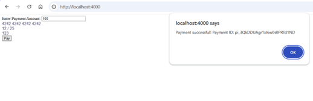
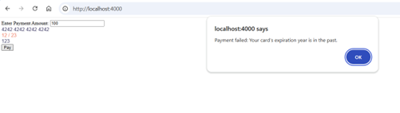
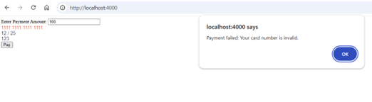
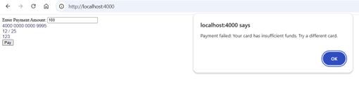
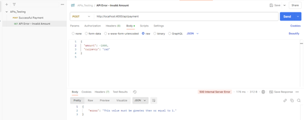

Payment Integration Documentation
________________________________________
Overview 
The payment integration system uses Stripe to process payments securely. It includes:
    •	A backend API for creating payment intents.
    •	A frontend form to collect user payment details.
    •	Error handling mechanisms to ensure smooth workflows.
This system ensures secure communication between the frontend and backend, validating user inputs and handling payments in CAD currency.

Useful Links
    •	Stripe Dashboard to manage your account and API keys: https://dashboard.stripe.com/
    •	Stripe API Reference to understand how Stripe APIs work: https://stripe.com/docs/api
    •	Step-by-step guide for implementing payment workflows: https://stripe.com/docs/payments
    •	List of test cards for validating payment flows: https://stripe.com/docs/testing

Technologies Used
    •	Node.js: Backend server.
    •	Express.js: Framework for handling API requests.
    •	Stripe API: For payment processing.
    •	HTML/CSS/JavaScript: Frontend payment form.

Setup Instructions
    1.	Clone the project:
        •	git clone https://github.com/Nigar0826/CapstoneProject_Winter2025
        •	cd https://github.com/Nigar0826/CapstoneProject_Winter2025
        •	git checkout payment_integration_Nigar
    2.	Install Dependencies: npm install
    3.	Configure Environment Variables:
        •	Create a .env file in the config/ folder:
            STRIPE_SECRET_KEY=sk_test_your_secret_key
            STRIPE_PUBLISHABLE_KEY=pk_test_your_publishable_key
        •	Replace sk_test_your_secret_key and pk_test_your_publishable_key with your actual Stripe API keys.
        •	Add keys.env to .gitignore to prevent exposing sensitive keys: config/keys.env
    4.	Start the Server: node server.js
        •	The server runs on http://localhost:4000.

Backend API Details
    •	Endpoint: /api/payment
    •	Method:POST
    •	Purpose: Creates a payment intent using Stripe API.
    •	Request Body (JSON format):
		    { 
    	        "amount": 1000, 
    	        currency": "cad"
 	        }
    •	Response (Success): 	{ "clientSecret": "pi_xxxxxxxxx_secret_xxxxxxxx" }
    •	Response (Error): { "error": "Error message" }

Middleware and Error Handling:
    •	400 Bad Request: Missing or invalid parameters.
    •	500 Internal Server Error: Server or Stripe API error.

Frontend Integration
    •	Payment Form Structure:
    •	File: public/index.html
    •	Fields: The form uses Stripe Elements for secure card data collection.
            -	Payment Amount
            -	Card Number
            -	Expiration Date
            -	CVC

    •	Frontend Code:
        •	File: public/js/payment.js
            - Mounting Stripe Card Fields: Stripe Elements are created and mounted for Card Number, Expiration Date, and CVC.
            - Sending Payment Requests: The form sends payment details to /api/payment, and the backend returns a           clientSecret to confirm the payment.
            - Confirming Payment: Use stripe.confirmCardPayment with the clientSecret to complete the payment.

Error Handling
    •	Backend Errors:
            - 400 Bad Request: For invalid data (e.g., negative amount).
            - 500 Internal Server Error: For Stripe-related issues or missing parameters.
    •	Frontend Errors:
            - Displays custom error messages for failed transactions (e.g., expired cards).

Test Cases

1. Successful Payment

2. Payment Failure – Expired Card

3. Payment Failure – Invalid Card Number

4. Payment Failure – Insufficient Funds

5. API Error – Invalid Amount

How to Test
    1.	Run the backend server (node server.js).
    2.	Open http://localhost:4000 in your browser.
    3.	Enter card details and amount in the payment form.
    4.	Submit the form and check responses:
            - Success: Payment confirmation displayed.
            - Failure: Proper error messages displayed.

Stripe Test Cards
    •	Valid Card: 4242 4242 4242 4242
    •	Expired Card: 4242 4242 4242 4242
    •	Insufficient Funds: 4000 0000 0000 9995

Workflow Documentation
    •	Frontend Workflow:
        1.	The user inputs payment details and amount in the frontend form.
        2.	The payment.js script interacts with the backend to get the client secret.
        3.	Stripe processes the payment using the client secret.
    •	Backend Workflow:
        1.	Validate the input from the frontend.
        2.	Creates a payment intent via the Stripe API.
        3.	Sends the client secret to the frontend for payment confirmation.